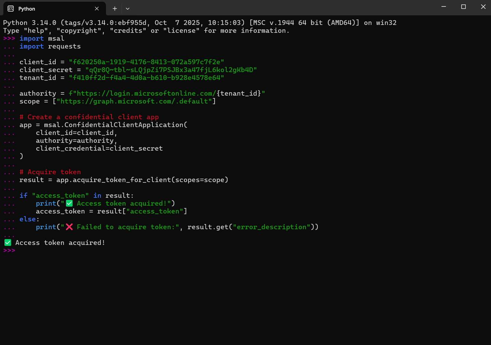
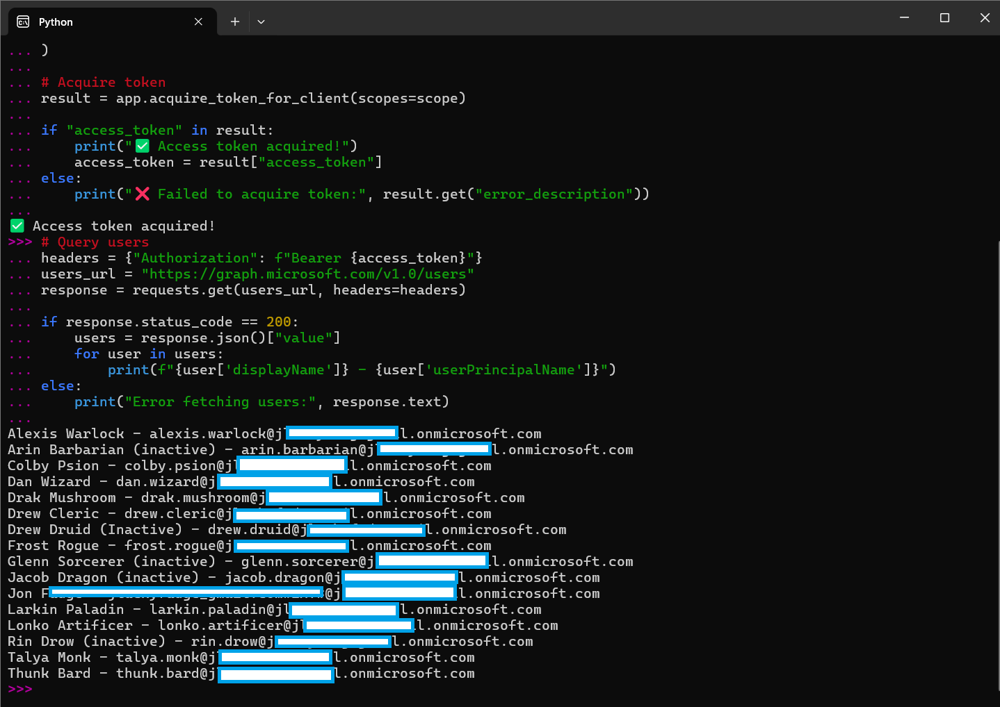
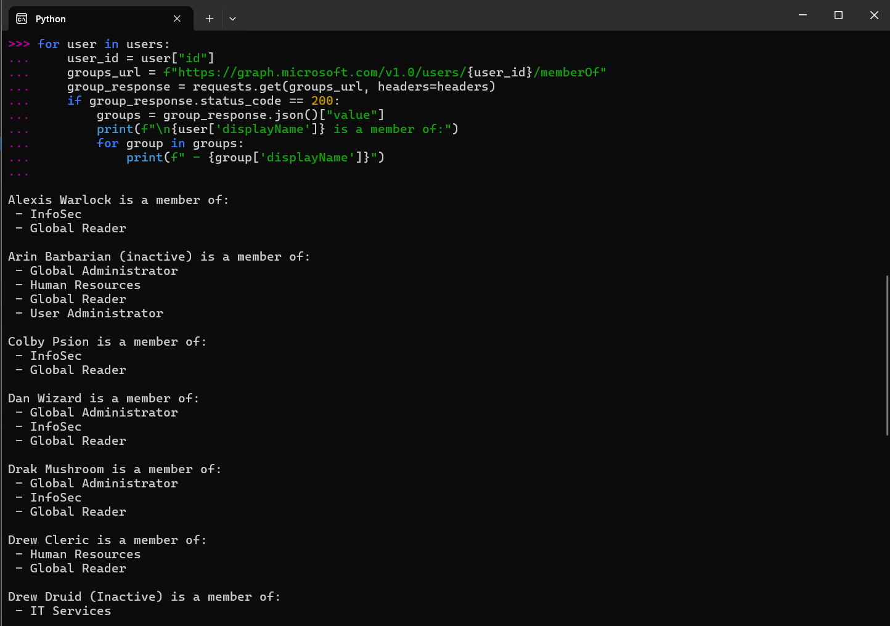
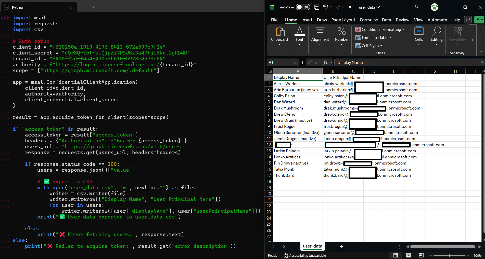
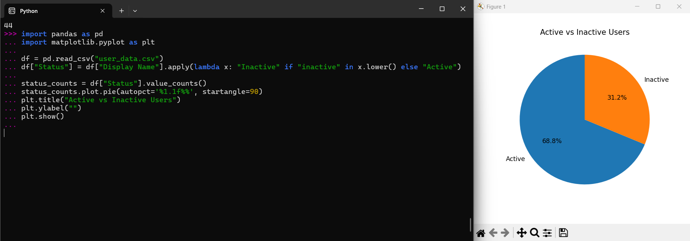

# Screenshots — Azure IAM Automation Lab
1. Access Token Call
2. Query Users
3. Query Members Of
4. Export CSV
5. Export Inactive Users
6. Active vs Inactive Users (piechart)

----------------------------------------

This folder contains screenshots that document key stages of the lab. Email addresses and domain names have been redacted to protect personal information.

---

### ✅ Token Acquisition
Successfully authenticated with Microsoft Graph using MSAL. Access token retrieved securely via client credentials.

---

### 👥 User Query via Graph API
Queried live user data from Azure AD, retrieving display names and user principal names.

---

### 👥 Group Membership Mapping
Enumerated group memberships for each user, including detection of privileged roles like Global Administrator.

---

### 📁 CSV Export
Exported structured user data to `user_data.csv`, including display name, email, and description fields.

---

### 🚨 Inactive Account Detection
Flagged users with "inactive" markers in their display names. Alerts logged to `inactive_accounts.csv`.

---

### 📊 Pie Chart Visualization
Visualized active vs inactive user distribution using Pandas and Matplotlib. Demonstrates operational insight.

